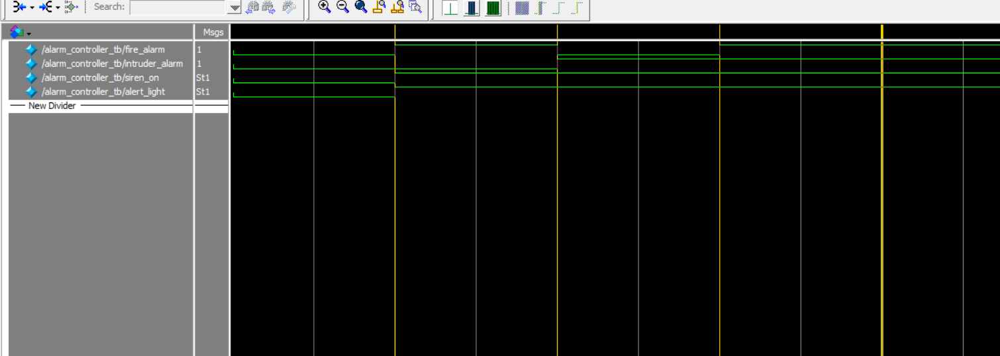

# 🚨 Verilog - Alarm Controller FSM

This project implements a simple Finite State Machine (FSM) in Verilog for an alarm system.  
It monitors **fire alarms** and **intruder alarms**, and controls a **siren** and **alert light** accordingly.

---

## 📁 Files Included

| File                     | Description                                           |
|--------------------------|-------------------------------------------------------|
| `alarm_controller.v`     | Main Verilog module implementing the alarm FSM       |
| `alarm_controller_tb.v`  | Testbench for simulating the module                  |
| `alarm_controller.vcd`   | VCD waveform file generated by ModelSim              |
| `monitor_log.txt`        | Text log from testbench monitoring output            |
| `wave_alarm_controller_tb.png` | ModelSim waveform screenshot                  |
| `RTL_alarm_controller.pdf`     | RTL schematic generated from Quartus         |

---

## 🔁 FSM Logic

| Fire Alarm | Intruder Alarm | Siren | Alert Light |
|------------|----------------|-------|-------------|
| 0          | 0              | 0     | 0           |
| 1          | 0              | 1     | 1           |
| 0          | 1              | 1     | 1           |
| 1          | 1              | 1     | 1           |

---

## 📷 Waveform Output

The waveform below shows the reaction of the system to changes in alarm input signals:

---

## 🛠 RTL Schematic

RTL (Register Transfer Level) schematic generated using Quartus:

📎 [View RTL Diagram (PDF)](RTL_alarm_controller.pdf)

---

## 🧰 Tools Used

- **ModelSim** – For simulation and waveform viewing  
- **Quartus Prime** – RTL design and schematic generation  
- **Verilog HDL** – Hardware description language
---
## 🧪 Simulation Example (from `monitor_log.txt`)

| Time (ns) | fire_alarm | intruder_alarm | siren_on | alert_light |
|-----------|------------|----------------|----------|-------------|
| 0         | 0          | 0              | 0        | 0           |
| 10        | 1          | 0              | 1        | 1           |
| 20        | 0          | 1              | 1        | 1           |
| 30        | 1          | 1              | 1        | 1           |

---

## ✅ Result

All logic was tested and verified successfully in ModelSim.
